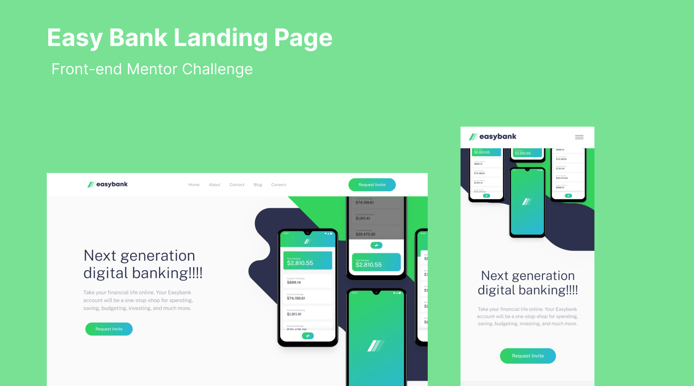

 

  # Easy Bank Landing Page

  

## Table of Contents

- [Project Structure](./docs/project-structure.md)
- [Style Guide](./docs/style-guide.md)
- [Contributing Guidelines](./docs/CONTRIBUTING.md)

## About
This is a challenge from Front-end Mentor that will provide ypu a nice test for your layout solve. 
  
I decided to start this project with friends so that we can learn more about how to contribute to open source projects and we see this as a great opportunity to test, practice and improve our ability to work as a team.

## Layout

You can view the project layout through [this Link](https://www.figma.com/community/file/1238393827801856905/Easybank-landing-page). It's necessary to have [Figma](https://www.figma.com/) account to acess it.
